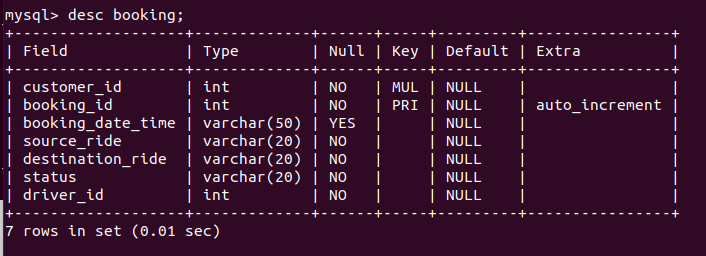

# Project-(Uber-Web-App)

##  Basically this project is totaly based on uber-app,So we can SingUp/SingIn/SignOut as a Customer and Driver, And Customer can book and cancel Ride and check booking-id and Driver can also cancel the ride and update booking.  

## Currently in this project there have only 3 Tables
### 1. Customer Table Details

### 2. Driver Table Details

### 3. Booking Table Details

